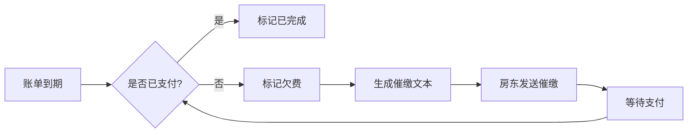

## 1. 产品概述

房东租金记账理财自动化工具是一款面向管理多套出租房的房东的专业财务管理工具，帮助房东高效整理月度收支，实现租金管理全流程自动化。

- **核心价值**：解决多房源管理中记账繁琐、对账困难、收益分析不清晰等痛点，通过自动化手段提升管理效率
- **目标用户**：拥有2套及以上出租房的个人房东、小型房产管理者
- **市场定位**：轻量化、专业化的房产租金管理SaaS工具

## 2. 核心功能

### 2.1 用户角色

| 角色 | 注册方式 | 核心权限 |
|------|----------|----------|
| 房东用户 | 本地使用，无需注册 | 完整使用所有功能，管理个人房产数据 |

### 2.2 功能模块

1. **仪表盘**：数据概览、收益趋势、快速操作入口
2. **导入模块**：银行流水导入、租金自动识别、交易匹配
3. **房源管理**：房源信息维护、空置天数统计、合同管理
4. **租客管理**：租客信息、合同到期日、欠费记录、押金管理
5. **账单管理**：应收清单自动生成、物业水电记录、维修支出
6. **提醒中心**：到期提醒、欠费提醒、催缴文本生成
7. **对账模块**：到账状态核对、异常金额提示、银行流水匹配
8. **报表中心**：房源收益分析、月度汇总、年度复盘、台账导出

### 2.3 页面详情

| 页面名称 | 模块名称 | 功能描述 |
|----------|----------|----------|
| 仪表盘 | 数据概览 | 本月收入/支出/净利润、房源入住率、应收未收金额、收益趋势图 |
| 仪表盘 | 快捷操作 | 快速登记收入、快速登记支出、新增房源、新增租客 |
| 导入页面 | 流水导入 | 支持CSV/Excel格式银行流水导入、智能识别交易类型 |
| 导入页面 | 租金识别 | 自动匹配租客租金、标记可疑交易、人工确认匹配 |
| 房源列表 | 房源管理 | 房源卡片展示、地址/面积/租金信息、空置状态、入住率统计 |
| 房源详情 | 房源信息 | 完整房源信息、历史租客、收支明细、收益分析 |
| 租客列表 | 租客管理 | 租客基本信息、联系电话、租住房源、合同期限、押金金额 |
| 租客详情 | 合同管理 | 合同信息、续租记录、欠费历史、缴费记录 |
| 账单列表 | 应收账单 | 自动生成月度应收清单、缴费状态、逾期标记 |
| 账单列表 | 支出记录 | 物业费、水电费、维修费等支出分类登记 |
| 提醒页面 | 到期提醒 | 合同到期、租金到期、缴费提醒列表 |
| 提醒页面 | 催缴管理 | 生成催缴短信/微信文本、一键复制、催缴记录 |
| 对账页面 | 流水对账 | 银行流水与账单自动匹配、差异标注、人工调账 |
| 对账页面 | 异常检测 | 金额异常、重复入账、遗漏收款智能提醒 |
| 报表页面 | 收益分析 | 按房源统计收益、成本、净利润、投资回报率 |
| 报表页面 | 月度汇总 | 按月度展示收支趋势、对比分析 |
| 报表页面 | 年度复盘 | 年度总收入、总支出、空置率、平均租金 |
| 报表页面 | 台账导出 | 支持Excel格式导出租金台账、收支明细 |

## 3. 核心流程

### 3.1 租金管理主流程

房东录入房源和租客信息 → 系统自动生成月度应收账单 → 导入银行流水 → 智能识别租金到账 → 自动对账标记状态 → 生成收益报表

### 3.2 催缴流程

账单到期未支付 → 系统标记欠费 → 生成催缴提醒 → 房东发送催缴信息 → 租客缴费后更新状态

## 4. 用户界面设计

### 4.1 设计风格

- **主色调**：深青色 #0F766E（专业、稳重、信任感）
- **辅助色**：琥珀色 #F59E0B（提醒、警示）、翠绿色 #10B981（成功、收入）、玫瑰红 #F43F5E（错误、支出）
- **中性色**：石板灰系列（背景、文字、边框）
- **按钮风格**：圆角8px，悬停有微动画和阴影变化
- **字体**：标题使用 "Noto Serif SC" 衬线字体体现专业感，正文使用 "Noto Sans SC" 无衬线字体保证可读性
- **布局风格**：左侧导航 + 右侧内容区，卡片式布局，数据可视化用图表展示
- **图标风格**：Lucide 线性图标，保持简洁统一

### 4.2 页面设计概述

| 页面名称 | 模块名称 | UI元素 |
|----------|----------|--------|
| 仪表盘 | 数据概览 | 统计卡片网格、面积图展示收益趋势、快捷操作按钮组 |
| 房源列表 | 房源卡片 | 卡片式布局，显示房源图片、地址、租金、入住状态 |
| 账单列表 | 数据表格 | 可筛选、可排序的表格，状态标签区分已付/未付/逾期 |
| 报表页面 | 数据可视化 | 柱状图对比房源收益、折线图展示月度趋势、环形图显示支出占比 |
| 导入页面 | 文件上传 | 拖拽上传区域、预览表格、匹配字段映射 |

### 4.3 响应式设计

- **桌面端优先**：1280px以上宽度完整展示所有功能
- **平板适配**：768px-1279px，侧边栏可折叠，表格支持横向滚动
- **移动适配**：375px-767px，底部导航栏，卡片堆叠布局，简化表格展示
- **触控优化**：按钮最小高度44px，重要操作区域增大点击范围

### 4.4 交互体验

- 页面加载采用淡入动画，数据加载显示骨架屏
- 卡片悬停有上浮效果和阴影加深
- 表单提交有加载状态和成功/失败反馈
- 数据删除前有二次确认弹窗
- 重要操作（如批量对账）有进度条展示
