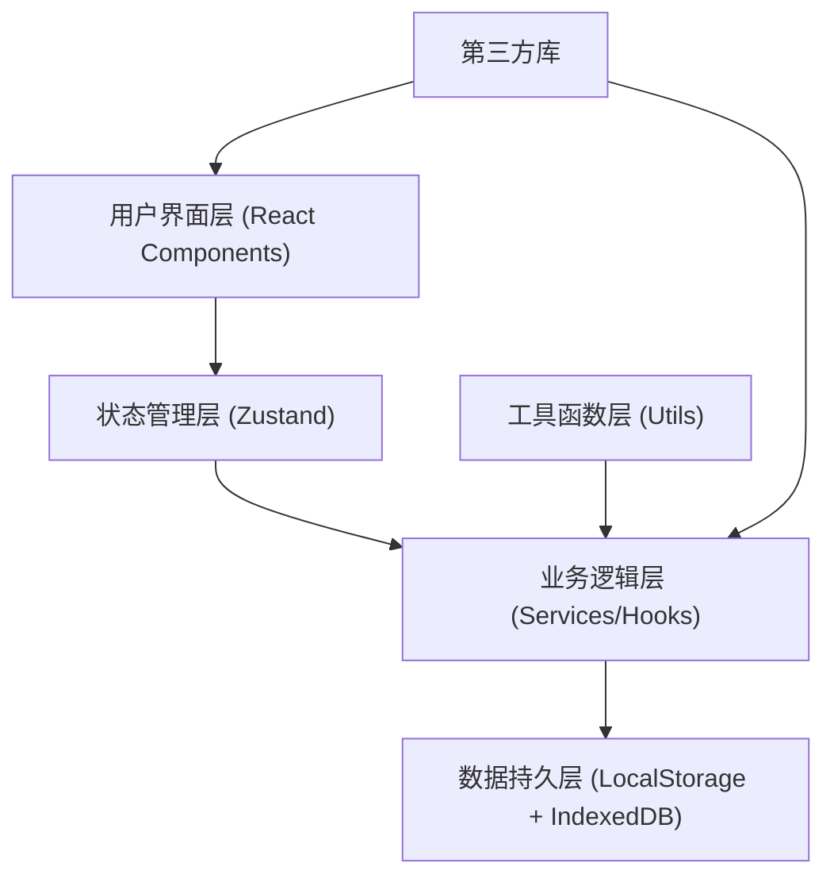
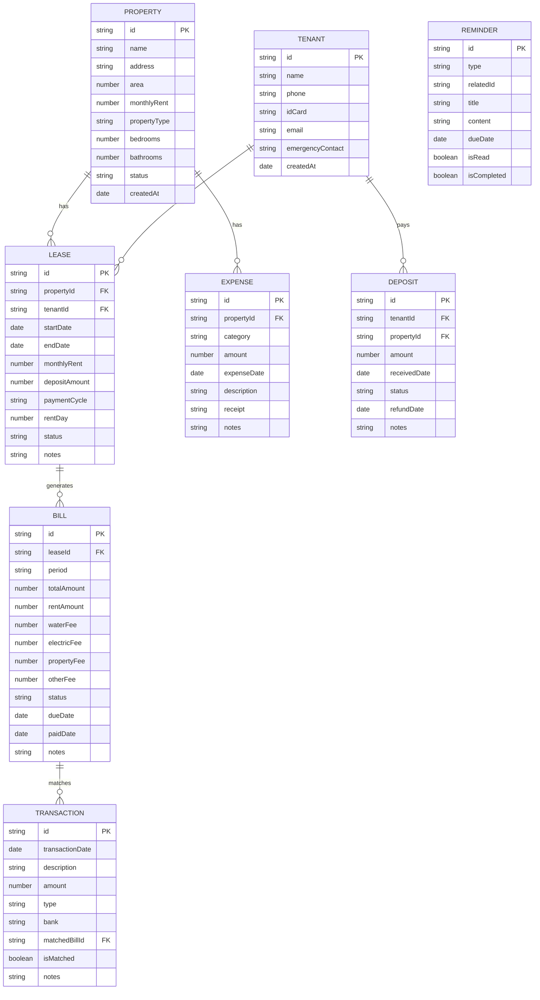

## 1. 架构设计

本项目采用纯前端单页应用架构，数据本地持久化存储，无需后端服务，降低部署和使用门槛。



## 2. 技术选型

| 层级 | 技术方案 | 版本 | 说明 |
|------|----------|------|------|
| 前端框架 | React | 18.x | 组件化开发，生态成熟 |
| 开发语言 | TypeScript | 5.x | 类型安全，提升可维护性 |
| 构建工具 | Vite | 5.x | 快速开发构建 |
| 样式方案 | Tailwind CSS | 3.x | 原子化CSS，快速开发 |
| 状态管理 | Zustand | 4.x | 轻量级状态管理，简单易用 |
| 路由管理 | React Router DOM | 6.x | 单页路由 |
| 图表库 | Recharts | 2.x | React生态图表组件 |
| 图标库 | Lucide React | 0.x | 高质量线性图标 |
| 文件处理 | PapaParse | 5.x | CSV文件解析 |
| Excel导出 | xlsx | 0.x | Excel文件导入导出 |
| 日期处理 | date-fns | 3.x | 轻量级日期处理库 |
| 数据存储 | LocalStorage + IndexedDB | - | 浏览器本地存储 |

## 3. 路由定义

| 路由路径 | 页面组件 | 功能说明 |
|----------|----------|----------|
| `/` | Dashboard | 仪表盘，数据概览 |
| `/properties` | PropertyList | 房源列表 |
| `/properties/:id` | PropertyDetail | 房源详情 |
| `/tenants` | TenantList | 租客列表 |
| `/tenants/:id` | TenantDetail | 租客详情 |
| `/bills` | BillList | 账单管理 |
| `/import` | ImportPage | 流水导入 |
| `/reminders` | ReminderPage | 提醒中心 |
| `/reconciliation` | ReconciliationPage | 对账管理 |
| `/reports` | ReportPage | 报表中心 |

## 4. 数据模型

### 4.1 ER图



### 4.2 数据初始化

应用首次加载时自动创建示例数据，包含3套房源、5个租客、6个月历史账单数据，方便用户快速体验功能。

## 5. 核心模块设计

### 5.1 状态管理 Store

```typescript
interface AppState {
  properties: Property[];
  tenants: Tenant[];
  leases: Lease[];
  bills: Bill[];
  transactions: Transaction[];
  expenses: Expense[];
  deposits: Deposit[];
  reminders: Reminder[];
  
  // 操作方法
  addProperty: (data: Omit<Property, 'id' | 'createdAt'>) => void;
  updateProperty: (id: string, data: Partial<Property>) => void;
  deleteProperty: (id: string) => void;
  
  addTenant: (data: Omit<Tenant, 'id' | 'createdAt'>) => void;
  updateTenant: (id: string, data: Partial<Tenant>) => void;
  deleteTenant: (id: string) => void;
  
  createBill: (leaseId: string, period: string) => Bill;
  generateMonthlyBills: (month: string) => Bill[];
  markBillPaid: (billId: string, paidDate: Date) => void;
  
  importTransactions: (file: File) => Promise<Transaction[]>;
  autoMatchTransactions: () => void;
  reconcileTransaction: (transactionId: string, billId: string) => void;
  
  getPropertyIncome: (propertyId: string, period?: string) => number;
  getPropertyExpense: (propertyId: string, period?: string) => number;
  getMonthlySummary: (month: string) => MonthlySummary;
  generateReminders: () => Reminder[];
  generateCollectionText: (billId: string) => string;
  exportLedger: (period?: string) => any[];
}
```

### 5.2 核心业务逻辑

1. **智能租金识别**：基于交易描述、金额、日期等特征，自动匹配对应账单
2. **自动对账算法**：对比银行流水与应收账单，标记匹配、差异、异常
3. **收益计算引擎**：按房源、按月度、按年度多维度计算收益
4. **催缴文本生成**：根据欠费金额、逾期天数、租客信息智能生成催缴话术
5. **异常检测**：金额偏离历史均值、重复入账、长期空置等异常识别

### 5.3 目录结构

```
src/
├── components/          # 公共组件
│   ├── Layout/         # 布局组件
│   ├── DataTable/      # 数据表格
│   ├── Card/           # 卡片组件
│   ├── Chart/          # 图表组件
│   ├── Form/           # 表单组件
│   └── Modal/          # 弹窗组件
├── pages/              # 页面组件
│   ├── Dashboard.tsx
│   ├── PropertyList.tsx
│   ├── PropertyDetail.tsx
│   ├── TenantList.tsx
│   ├── TenantDetail.tsx
│   ├── BillList.tsx
│   ├── ImportPage.tsx
│   ├── ReminderPage.tsx
│   ├── ReconciliationPage.tsx
│   └── ReportPage.tsx
├── store/              # 状态管理
│   └── useStore.ts
├── types/              # 类型定义
│   └── index.ts
├── utils/              # 工具函数
│   ├── date.ts
│   ├── finance.ts
│   ├── import.ts
│   ├── export.ts
│   └── reminder.ts
├── hooks/              # 自定义Hooks
│   ├── useFinance.ts
│   ├── useImport.ts
│   └── useReminder.ts
├── mock/               # 模拟数据
│   └── seed.ts
├── App.tsx
├── main.tsx
└── index.css
```

## 6. 数据持久化方案

- **LocalStorage**：存储配置信息、用户偏好，数据量 < 5MB
- **IndexedDB**：存储交易流水、账单等大量数据，支持复杂查询
- **自动备份**：每次数据变更后自动创建本地备份，支持数据导出/导入
- **数据加密**：敏感信息（身份证、手机号）本地加密存储

## 7. 性能优化

- 大数据量表格采用虚拟滚动
- 图表数据按需加载
- 状态变更采用批量更新
- 路由懒加载（核心页面除外）
- IndexedDB查询使用索引优化
